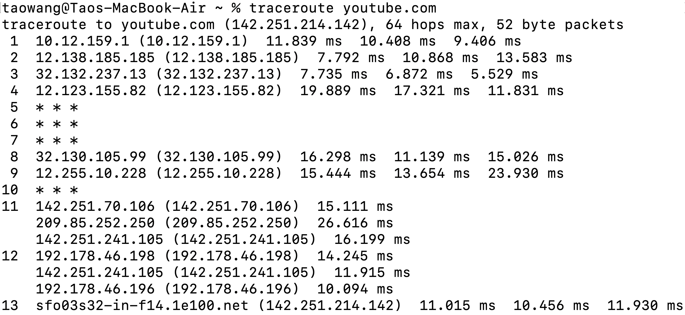
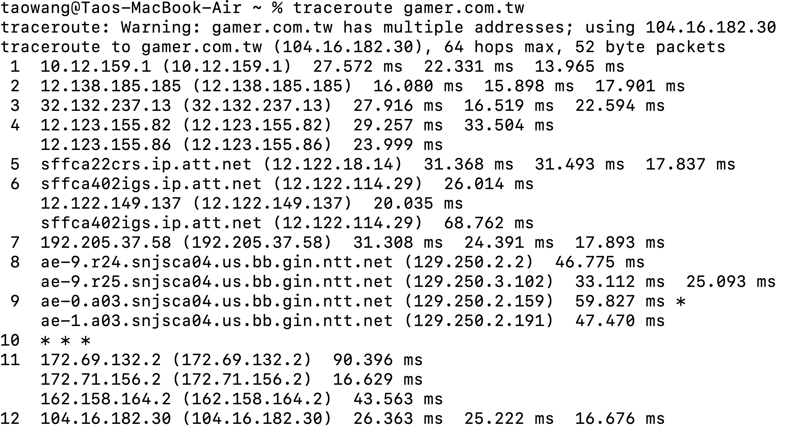

# Q8

## Source and Destination inside a Continent

**Mean** = 
$\frac{11.015 + 10.456 + 11.930}{3} = 11.13 \space ms$

**Standard Deviation** = 
$\sqrt{\frac{{(11.015-11.13)^2 + (10.456-11.13)^2} + (11.930-11.13)^2}{3}} = 0.608 \space ms$

**Number of Intervening Routers** = 12

**Different Domain:** 
* sfo03s32-in-f14.1e100.net

## Source and Destination on Different Continents

**Mean** = 
$\frac{26.363 + 25.222 + 16.676}{3} = 22.75 \space ms$

**Standard Deviation** = 

$\sqrt{\frac{{(26.363 - 22.75)^2 + (25.222 - 22.75)^2} + (16.676 - 22.75)^2}{3}} = 4.323 \space ms$

**Number of Intervening Routers** = 11

**Different Domain:** 
* sffca22crs.ip.att.net
* sffca402igs.ip.att.net
* sffca402igs.ip.att.net
* ae-9.r24.snjsca04.us.bb.gin.ntt.net
* ae-9.r25.snjsca04.us.bb.gin.ntt.net
* ae-0.a03.snjsca04.us.bb.gin.ntt.net
* ae-1.a03.snjsca04.us.bb.gin.ntt.net

