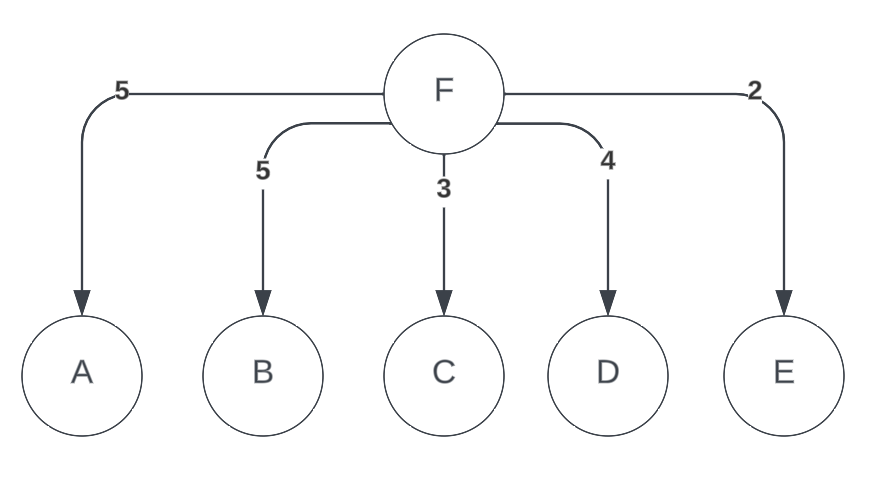

**A.**

**B.**

| Source | A | B | C | D | E |
| -------|---|---|---|---|---|
| Next Hop | D | F | E | E | F | 

**C.** 

* Distance Table at C

    To node F Via

    | D | E | F |
    | --|---|---|
    | 7 | 3 | 5 |

* Distance Table at E

    To node F Via

    | B | C | D | F |
    | --|---|---|---|
    | 12  | $\infty$ | $\infty$ | 2 |

**D.** E will advertise that $D_E(F) = 2$ to neighbors B, C, and D.

**E.** 

* Distance Table at E

    To node F Via 

    | B | C | D | F | 
    |---|--|--|--|
    | 12 | 6 | 9 | $\infty$ |

* Announcement from E

    | B | C | D | 
    |---|--|--|
    | 12 | $\infty$ | 12 |

**F.** 

* Table at C

    To node F Via

    | D | E | F |
    |---|---|---|
    | 10 | $\infty$ | 5 |
