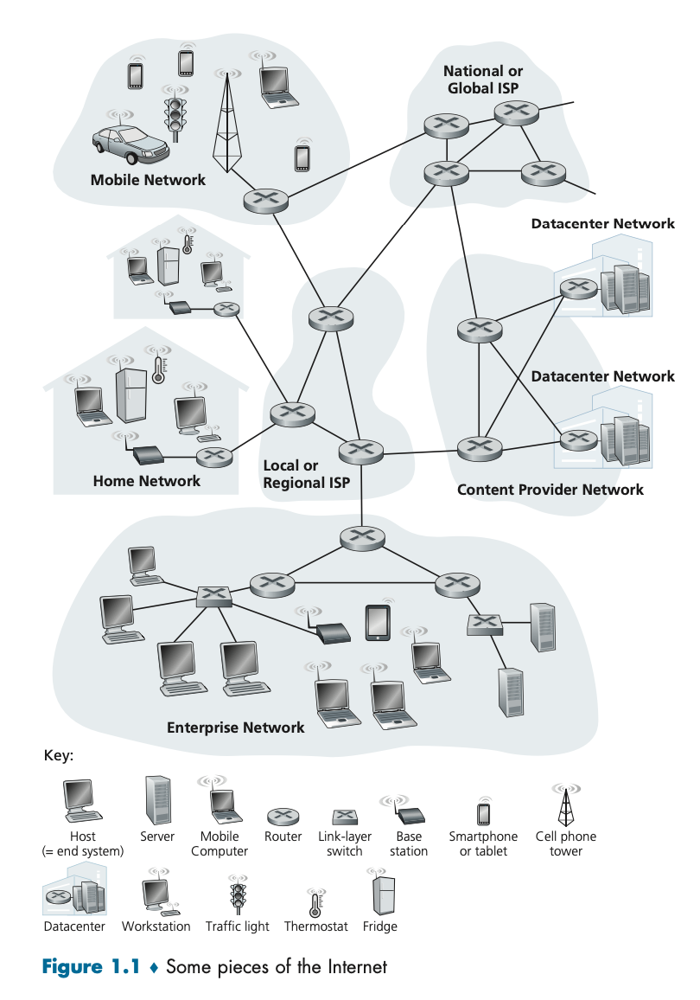
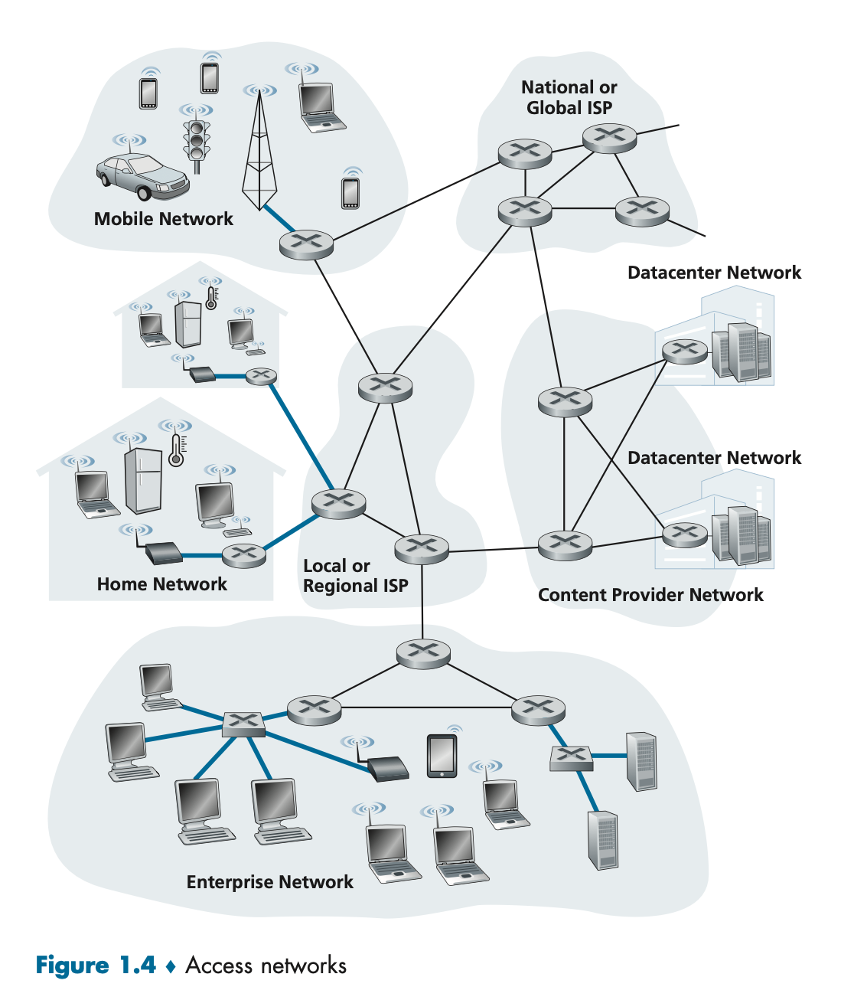
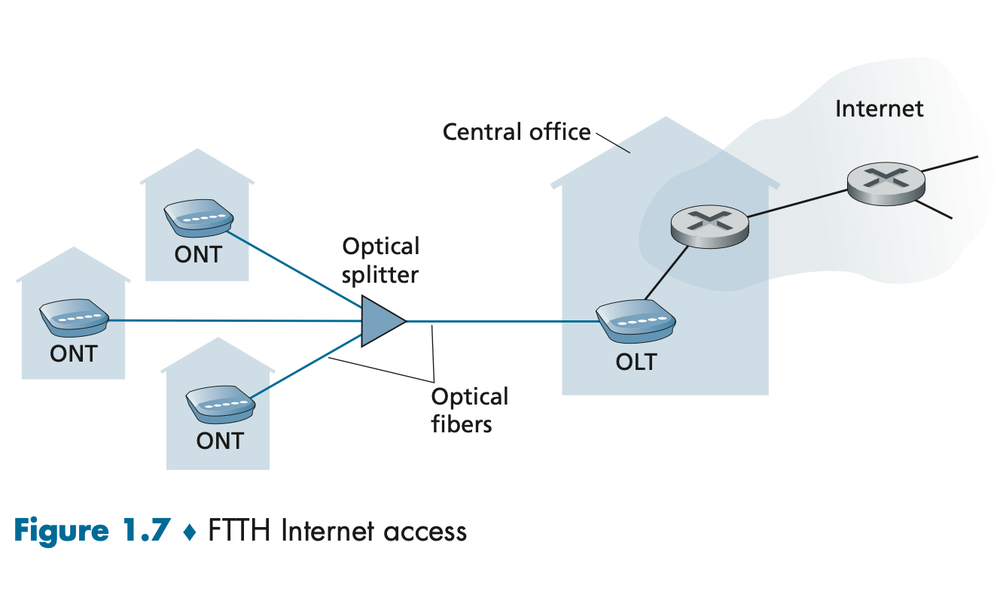

# What's the Internet

## 
The internet is a computer network that interconnects billions of computing devices across pyhsical locations.

End systems are connected by a network of
* **Communication links (coaxial cable, optical fiber)**
* **Packet switches**. 

Different links can transmit data at a different rate, with the transmission rate of a link measured in **bits/second**.

## End System
When one end system sends data to another end system, the sending end system **segments** the data and adds header bytes to each segment. The resulting **packets** is sent through the network to the destination end system, where they are reassembled into the original data.

The end system also needs a **socket interface** that specifies how a program running the one end system asks the internet infrastructure to deliver data to a specific destination program on another end system.

## Protocol
* Defines the format and the order of messages exchanged between two or more communicating entities, as well as the actions taken on the transmission or receipt of a message or other event.

# The Network Edge
**hosts = end system**

## Access Networks
Access Network physically connects an end system to the first router on a path from the end system to any other end system.

**Home Internet Access through Telephone Line**
* Also called DSL Internet Access.
* Uses existing telephone line with **twisted pair copper cable**.
* **Digital Subscriber Line (DSL)**: a residence obtains DSL from telecom compnay that also provides wired local phone access.
1.  The DSL modem converts data signal from Home PC into analog format through analog modulation, then send it through existing telephone line to **Disigtal Subscriber Line Access Multiplexer (DSLAM)**.
2.  DSLAM separates the data and telephone analog signals and demodulate the data to digital format and route them.
3. The splitter separates the data and telephone signals and forward the data signal to the DSL modem.

**Home Internet Access through Cable**
* Also called **Hybrid Fiber Coax (HFC)**.
* Makes use of cable TV company's cable infrastructure that has **coaxial cable**.
* It's a **Shared Broadcast Medium**. If several users simultaneously download a video, the actual rate wil be slower than the aggregate cable downs stream rate.
* Cable modems divide the HFC network into a downstram and an upstream channel.
* **Cable Modem Termination System (CMTS)** turns the analog signal from the cable modems in downstream homes back into digital format.

**Home Internet Access through Fiber Cable**
* Also called **fiber to the home (FTTH)**

**Transmission Medium**
* Twisted-Pair Copper Wire
    * For landline and DSL
* Coaxial Cable
    * For Cable TV and HFC
* Fiber Optics
    * Low signal attenuation
    * Hard to eavesdropp
    * For FTTH
* Terrestrial Radio Channels
* Satellite Radio Channels