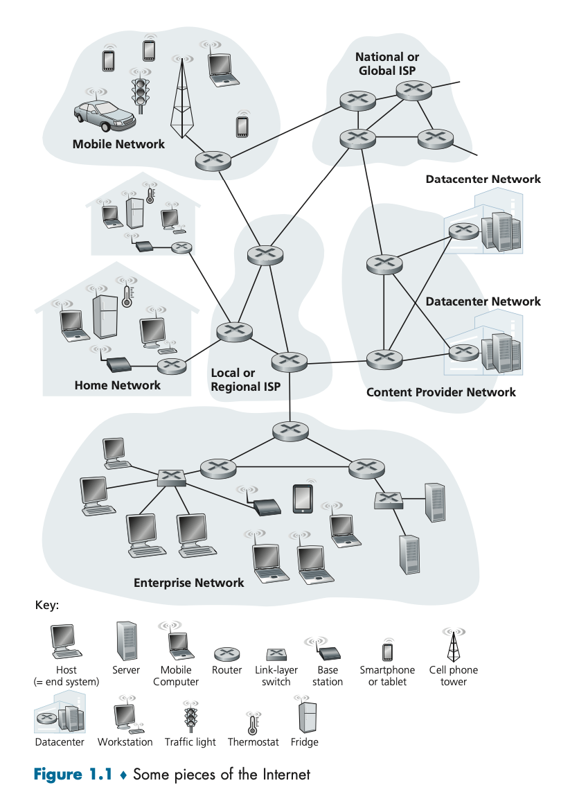
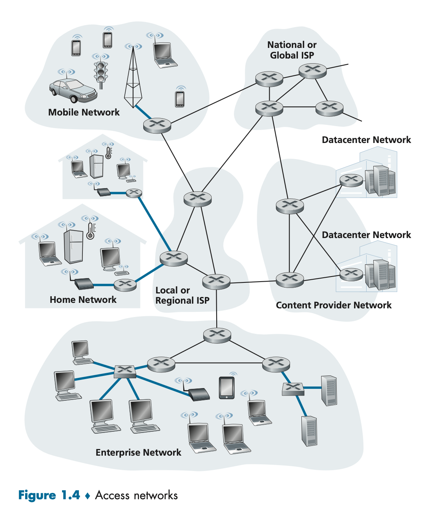
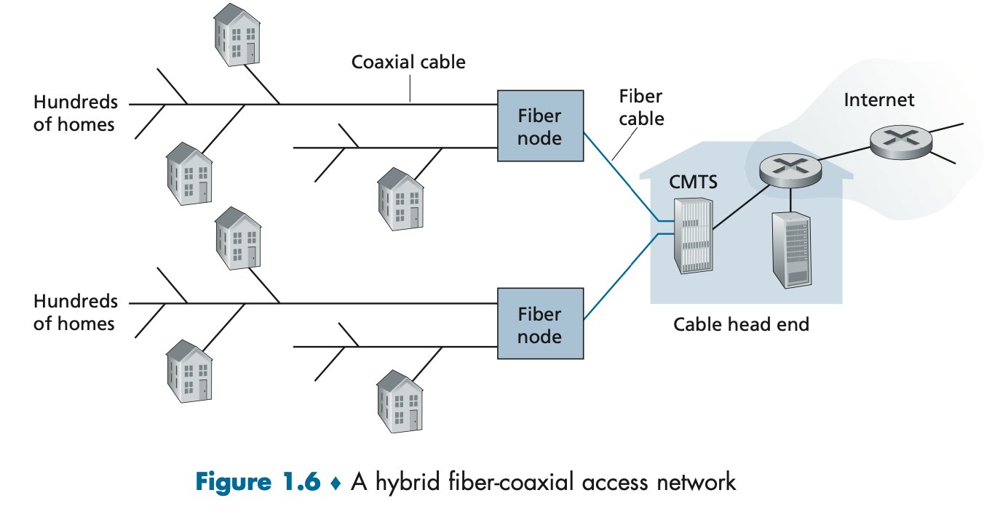
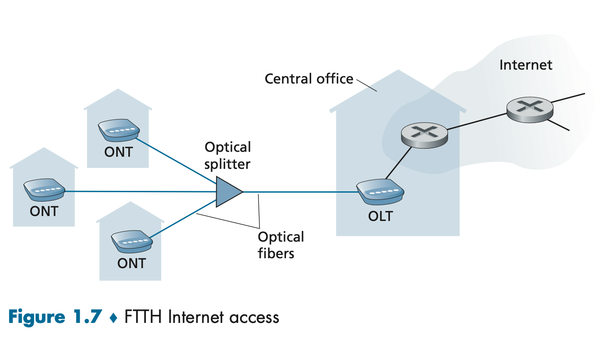
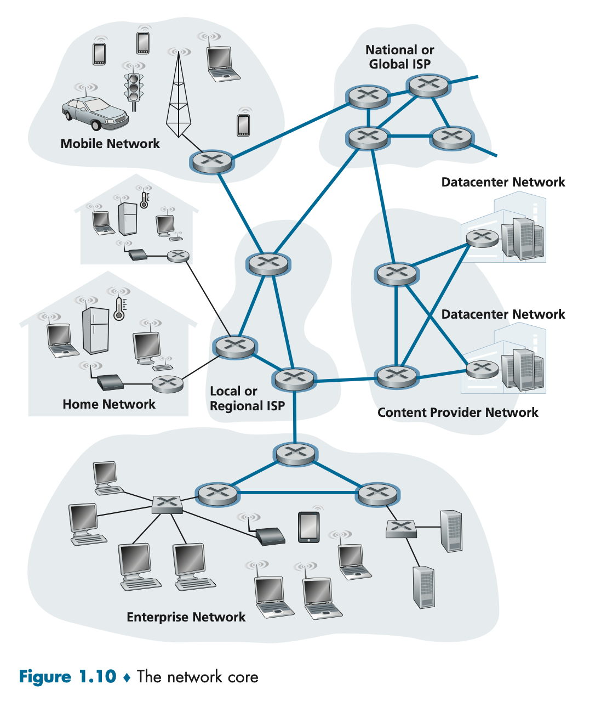
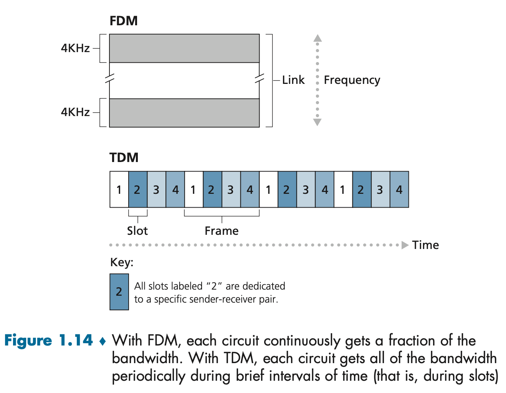

# What's the Internet

The Internet is a computer network that interconnects billions of computing devices across pyhsical locations.



End systems are connected by a network of
* **Communication links (coaxial cable, optical fiber)**
* **Packet switches**. 


Different links can transmit data at a different rate, with the transmission rate of a link measured in **bits/second**.

## End System
When one end system sends data to another end system, the sending end system **segments** the data and adds header bytes to each segment. The resulting **packets** are sent through the network to the destination end system, where they are reassembled into the original data.

The end system also needs a **socket interface** that specifies how a program running the one end system asks the internet infrastructure to deliver data to a specific destination program on another end system.

## Protocol
* Defines the format and the order of messages exchanged between two or more communicating entities, as well as the actions taken on the transmission or receipt of a message or other event.

## The Network Edge
**hosts = end system**

### Access Networks
Access Network physically connects an end system to the first router on a path from the end system to any other end system.



**Home Internet Access through Telephone Line**
* Also called DSL Internet Access.
* Uses existing telephone line with **twisted pair copper cable**.
* **Digital Subscriber Line (DSL)**: a residence obtains DSL from a telecom company that also provides wired local phone access.
1.  The DSL modem converts data signal from the Home PC into analog format through analog modulation, then sends it through an existing telephone line to **Digital Subscriber Line Access Multiplexer (DSLAM)**.
2.  DSLAM separates the data and telephone analog signals demodulates the data to digital format and routes them.
3. The splitter separates the data and telephone signals and forwards the data signal to the DSL modem.


**Home Internet Access through Cable**
* Also called **Hybrid Fiber Coax (HFC)**.
* Makes use of a cable TV company's cable infrastructure that has **coaxial cable**.
* It's a **Shared Broadcast Medium**. If several users simultaneously download a video, the actual rate will be slower than the aggregate cable down. stream rate.
* Cable modems divide the HFC network into a downstream and an upstream channel.
* **Cable Modem Termination System (CMTS)** turns the analog signal from the cable modems in downstream homes back into digital format.


**Home Internet Access through Fiber Cable**
* Also called **fiber to the home (FTTH)**



**Transmission Medium**
* Twisted-Pair Copper Wire
    * For landline and DSL
* Coaxial Cable
    * For Cable TV and HFC
* Fiber Optics
    * Low signal attenuation
    * Hard to eavesdropp
    * For FTTH
* Terrestrial Radio Channels
* Satellite Radio Channels

## The Network Core



### Packet Switching
* There are two fundamental approaches to moving data through a network of links and switches: **circuit switching** and **packet switching**.
* To send a message from a source end system to a destination end system, the source breaks long messages into smaller chunks of data known as **packets**.
* Between the source and destination, each packet travels through communication links and **packet switches (eg., routers and link-layer switches)**.

**Input Buffer**
* Most packet switches use **store-and-forward transmission**. It must receive the entire packet before it can begin to transmit the first bit of the packet outward.
* The Router first **buffer (stores)** the packet's bits, then forwards the packet onto the outbound link.

**Output Buffer and Packet Loss**
* Each packet switch also has an **output buffer (output queue)**. If the arriving packet needs to be transmitted to a link but finds the link busy, the arriving packet must wait in the output buffer.
* If the output queue is full and a packet needs to be stored in the buffer, a **packet loss** will occur - either the arriving packet or one of the queued packets will be dropped.

**Forwarding and Routing Protocols**
* When a source end system wants to send a packet to a destination end system, the source includes the destination's IP address in the packet's header.
* Each router has a **forwarding table** that maps the destination address to that router's outbound links. 
* When a packet arrives at a router, the router examines the address and searches its forwarding table, using this destination address to find the outbound link and route it there.
* The internet has several special **routing** protocols** to automatically set the forwarding tables.

### Circuit Switching
* The resources needed along a path (buffers, link, transmission rate) to provide for communication between the end systems are **reserved** for the duration of the communication session between the end systems, contrary to that of the packet-switched network.
* Before sending any information, the network **must first establish a connection (circuit)** between the sender and the receiver.
* The sender can transfer the data to the receiver at the **guaranteed** constant rate.

**Multiplexing in Circuit-Switched Networks**
A circuit in a link is implemented with either FDM or TDM.



* **Frequency-Division Multiplexing (FDM)**: the frequency spectrum of a link is divided up among the connections established across the link, and the width of the band is **bandwidth**.
* **Time-Division Multiplexing (TDM)**: for a TDM link, time is divided into frames of fixed duration, and each frame is divided into a fixed number of time slots. When the network establishes a connection across a link, the network dedicates one time slot in every frame to this connection.

```
// Example

Let us consider how long it takes to send a file of 640,000 bits from Host A to Host B over a circuit-switched network. Suppose that all links in the network use TDM with 24 slots and have a bit rate of 1.536 Mbps. Also suppose that it takes 500 msec to establish an end-to-end circuit before Host A can begin to transmit the file. How long does it take to send the file?

Each circuit has a transmission rate of (1.536 Mbps / 24) = 64 kbps, so it takes (640000 bits) / (64 kbps) = 10 seconds to transmit the file. 
In total, the system needs 10.5 seconds to send the file.
```

### Packet Switching vs. Circuit Switching
**Advantages of Packet Switching**
* Better sharing of transmission capacity than circuit switching.
* It is simpler, more efficient, and less costly to implement than circuit switching.
* Allows more users.

### Four Sources of Packet Delay

$d_{packet} = d_{proc} + d_{queue} + d_{trans} + d_{prop}$

* Nodal Processing $d_{proc}$
* Queuing Delay $d_{queue}$
* Transmission Delay: $d_{trans} = \frac{L}{R}$, where L is the packet length (bits), and R is the transmission rate (bps)
* Propagation Delay: $d_{prop} = \frac{d}{s}$, where d is the length of the physical link, and s is the propagation speed (~$2*10^8 \space m/sec$)

$d_{total} = (Number \space of \space Packet - 1) * d_{trans} + (Number \space of \space Hops) * (d_{trans} + d_{prop})$

### Model of a Router
* Router = input buffer (queue) + CPU.
* Assume a fixed-sized packet of L bits.
* Queuing Delay Formula: $E(X) = \frac{La/R}{1- La/R}$, where a is the arrival rate, R/L is the departure rate, and $La/R$ is the traffic intensity. As $La/R$ approaches 1, the traffic intensity becomes greater.
* When the buffer is full, a packet is dropped.
* Throughput: rate (bits/time unit)
