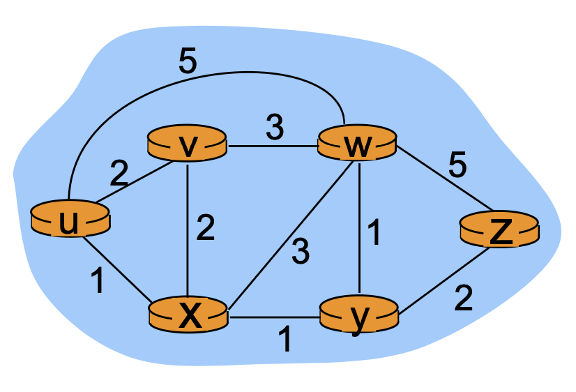
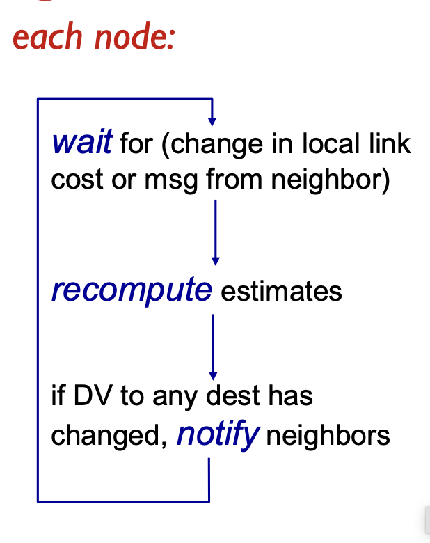
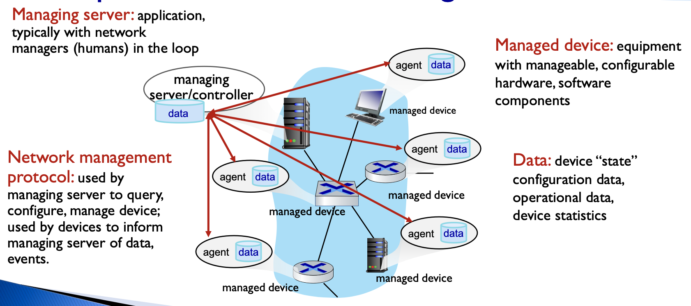
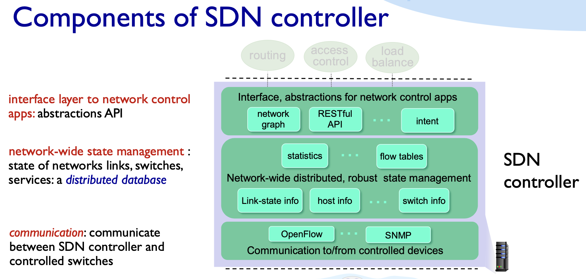

# The Network Layer

It only has 1 protocol, the **IP**.
The Network Layer's packet is called a **datagram**.

**Key Function**
* Transport segment from sending to receiving host.
* **Forwarding**: move packets from the router's input to its output.

## Router
**Data Plane (Forwarding)**
* Determines locally how datagram arriving on router's input port is forwarded to router's output port.

**Control Plane (Routing)**
* Determine how the datagram is routed from sending to the receiving host.
* Routing algorithm interacts with the control plane.
* Remote controller computes and installs forwarding tables in routers (Software-Defined Networking).

**Software-Defined Networking (SDN)**
* The control plane is implemented not on each router but on a central control plane in ISP's remote server.
* The ISP performs the routing and each router does the forwarding.

## Network-Layer Service Model
**Best-Effort Service**

No guarantees on:
* Successful datagrams delivery to destination.
* Timing or order of delivery.
* Bandwidth available to end-end flow.

## The End-End Argument

## Router

### Input Port
**Decentralized Switching:** using header field values, look up output port using forwarding table in input port memory.

**Destination-Based Forwarding:** forward based only on destination IP address.

**Generalized FOrwarding:** foward based on any set of header field values.

## Longest Pre-Fix Match
* Use the output port that produces the longest prefix matching in the address table.

## Switching Fabric
* Transfer packet from input link to the appropriate output link.
* **Switching via Memory**
    * Packet copied to system's memory.
    * Speed is limited by memory bandwidth.
* **Switching via a Bus**
    * datagram from input port memory to output port memory via a shared bus.
* **Switching via Interconnection Network**
    * Interconnection net that exploits parallelism.
    * Fragment the datagram into fixed-length cells and switch cells through the fabric, reassemble the datagram at the exit.

### Input Port Queuing
* If switch fabric slower than input ports combined -> queueing may occur at input queues.

### Buffer Management
* Drop: which packet to add, drop when buffers are full.
    * Tail Drop: drop the arriving packet.
    * priority: drop/remove on a priority basis.

### Output Port Packet Scheduling
* Deciding which packet to send next on the link.
* **FCFS:** 
    * Packets are transmitted in order of arrival to the output port.
    * FIFO
    
* **Priority**
    * arriving traffic classified, queued by class.
    * send packet from highest priority queue that has buffered packet.
    
* **Round Robin (RRs)**
    * arriving traffic classified, queue by class.
    * send one complete packet from each class in turn.
    

## IP Address

### IPv4 Datagram Format

**How Much Overhead?**
* 20 bytes of TCP + 20 bytes of IP 
* = 40 bytes + application layer overhead

* **Version Number:** these 4 bits specify the IP protocol version of the datagram. Different IP version uses different datagram formats.
* **Header Length:** specifies the size of the header so the receiver knows where the data to be transmitted begins. This field is necessary because the IPv4 header can be of variable length due to the optional fields it may contain.
* **Type of Service:** type of data.
* **Length:** total datagram length (header + data) in bytes.
* **Identifier, Flags, Fragmentation Offset:** they have to do with **IP fragmentation**, which happens when a large IP datagram is broken into several smaller IP datagrams, then forwarded independently to the destination, where they are reassembled before their data is passed up to the transport layer.
* **Time-To-Live (TTL):** The TTL field prevents datagrams from circulating forever (ex: a long-lived routing loop) in the network. This field is decremented by one each time the datagram is processed by a router. If the TTL field reaches 0, a router must drop that datagram.
* **Protocol:** used when an IP datagram reaches its final destination. This field's value indicates the specific transport-layer protocol to which the data portion of this IP datagram should be passed. It **binds the network and transport layer together**
* **Header Checksum:** Aids a router in detecting bit errors of the header in a received IP datagram.
* **Source and Destination IP Address:** When a source creates a datagram, it inserts its IP address into the source IP address field and inserts the address of the destination into the destination IP address field.
* **Options:** allows an IP header to be extended.
* **Data (Payload):** the data to be delivered to the destination. Also contains the transport-layer segment (TCP/UDP) to be delivered to the destination.

### IPv4 Address
* IP Address: 32-bit identifier for host, router interface.
* Interface: connection between host/router and physical link.
* Each interface on every host and router in the global Internet must have a globally unique IP address.
* A portion of an interface's IP address will be determined by the subnet to which it is connected.

**Public vs. Private IP Address**

### Subnets
* A **Subnet** is a part of a larger network. 
* IP addressing assigns an address to this subnet: 223.1.1.0/24, the /24 is known as the **subnet mask**, which indicates that the leftmost 24 bits of the 32-bit address define the subnet address.

**CIDR Notation**
* Stands for classless interdomain routing.
* Address format: a.b.c.d/x where x is #bits in the subnet portion of the address.

### DHCP: Dynamic Host Configuration Protocol
* Allow the host to dynamically obtain its IP address from the network server when it joins the network.
* Often built into the router to assign private IP addresses.

### NAT: Network Address Translation
* NAT translates the private IP address into a public IP address so that each household only needs 1 public IP but could assign many private IP to different devices.
* Controversies: a router should not mess with the port number.

### IPv6
* Fixed-length 40-byte header.
* No fragmentation allowed.
* Checksum: removed entirely to reduce processing time at each hop.

### Transition from IPv4 to IPv6
* Not all routers can be upgraded simultaneously.
* **Tunneling:** IPv6 datagram carried as payload in IPv4 datagram among IPv4 routers.

The IPv6 packet is sent as the data inside an IPv4 packet from B to E.

### Generalized Forwarding and SDN
* Each router contains a forwarding table
* **Match Plus Action:** match bits in the arriving packet, and take action.
    * **Destination-Based Forwarding:** forward based on destination IP address.
    * **Generalized Forwarding:** many header fields can determine action with many actions possible.

**Flow Table Example**

## The Control Plane
### Routing Protocols
**Goal:** determine a good path from sending hosts to receiving hosts through a network of routers.

**Good Path:** least cost, fastest, least congested.

**Cost** could be inversely related to bandwidth. **c(x, x') = cost of link (x, x')**

EX: c(w,z) = 5

### Routing Algorithm Classification
1. Global
    * All routers have complete topology, link cost info.
    * **Link State Algorithm**.
2. Decentralized
    * Router knows physically connected neighbors, link costs to neighbors.
    * Exchange info with neighbors.
    * **Distance Vector Algorithm**
3. Static
    * Routes change slowly over time.
4. Dynamic
    * Routes change more quickly.
    * Periodic update.

### Link-State Routing Algorithm
* Dijkstra's Algorithm
    * Net topology, link costs are known to all nodes.
    * Computes least cost paths from one node to all other nodes.
* Notation
    * c(x, y): link cost from node x to y; c(j, k) = $\infty$ if j and k are not direct neighbors.
    * D(v): the current value of the cost of the path from source to destination, v.
    * p(v): predecessor node along the path from source to v.
    * N': a set of nodes whose least cost path definitely known.
* Time Complexity: O(n^2)
* Oscillation possible.

### Distance Vector Algorithm
* Bellman-Ford Equation (Dynamic Programming)
* From time-to-time, each node sends its own distance vector estimate to neighbors.
* When x receives a new DV estimate from a neighbor, it updates its own DV using the B-D equation.
* When link cost decreases, the news travels **fast** to other nodes.
* When **link cost increases**, the news travels **slow** to other nodes.

Let $d_x(y)$ = cost of least-cost path from x 
to y, then 
$$d_x(y) = min_v\{c(x, y) + d_v(y)\}$$

### Comparison of Link-State and Distance Vector Algorithms

* LS:
    1. Node can advertise incorrect link cost.
    2. Each node computes only its own table.
    3. May have oscillations.
* DV:
    1. DV node can advertise incorrect path cost.
    2. Error propagates through the network.
    3. Count-to-infinity problems.

### Hierarchical Routing
* Aggregate routers into regions, **"autonomous systems (AS)"**
* Routers in the same AS run the same routing protocol called **intra-AS routing protocol**.
* **Inter-AS Routing Protocol** routes across different AS.
* **Gateway Router**:** at the edge of its own AS and has a link to the router in another AS.

**EX:** AS1 learns via **inter-AS protocol** that subnet x is reachable via AS3, but not via AS2. The **Inter-AS Protocol** propagates reachability to all internal routers.

### Intra-AS Routing
* RIP: Routing Information Protocol
* EIGRP: Enhanced Interior Gateway Routing Protocol
* **OSPF**: Open Shortest Path First
    * Link-State routing.
    * Advertisements flooded to **entire** AS.
### Inter-AS Routing
* **BGP (Border Gateway Protocol)**
    * determine good routes to other networks based on reachability information and policy.
    * **eBGP:** obtain subnet reachability information from neighboring ASs.
    * **iBGP:** propagate reachability information to all AS-internal routers.
### ICMP
* Used by hosts and routers to communicate network-level information.
* Network layer above IP.

### Components of Network Management

### How Network Operator Manages the Network
* CLI: operator issues scripts directly to individual devices via ssh.
* SNMP/MIB: operator sets device data using Simple Network Management Protocol (**SNMP**)
* NETCONF/YANG: multi-device configuration management.

### Software Defined Networking (SDN)
* Internet network layer historically implemented via a distributed, per-router control approach.
* In SDN, the remote controller computes and installs forwarding tables in routers.
* Easier network management that avoids router misconfigurations.
* The central manager is called the **controller**, which uses the **OpenFlow Protocol** to control the switches (router).

**Controller-to-Switch Message**
* Configuration: allows the controller to query and set switch parameters.
* Modify-State: used by the controller to add/remove/modify the switch's flow table entry, and to set switch port property.
* Read-State: used by the controller to collect statistics and counter values from the switch flow table and port. 
* Send-Packet: used by the controller to send a specific packet out of the switch's port.
* Flow-Removed: inform the controller that a flow table entry has been removed
* Port-Status: inform the controller of change in switch's port.

