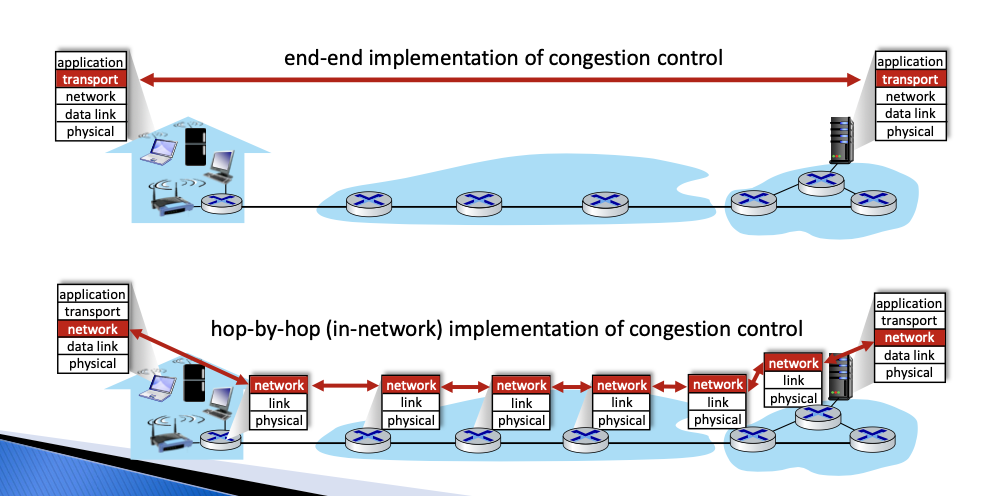

# The Network Layer

It only has 1 protocol, the **IP**.

**Key Function**
* Transport segment from sending to receiving host.
* **Forwarding**: move packets from the router's input to its output.

**Data Plane**
* Determines how data gram arriving on router input port is forwarded to router output port

**Control Plane**
* Determine how the datagram is routed from sending to the receiving host.
* Routing algorithm interacts with the control plane.
* Remote controller computes and installs forwarding tables in routers (Software-Defined Networking).

**Example Services for Individual Datagrams**
* Guaranteed delivery.
* Doesn't guarantee the order of arrival.

## Network-Layer Service Model
No guarantees on:
* Successful datagrams delivery to destination.
* Timing or order of delivery.
* Bandwidth available to end-end flow.

## The End-End Argument

## Longest Pre-Fix Match
* Use the output port that produces the longet prefix matching in the address table.
