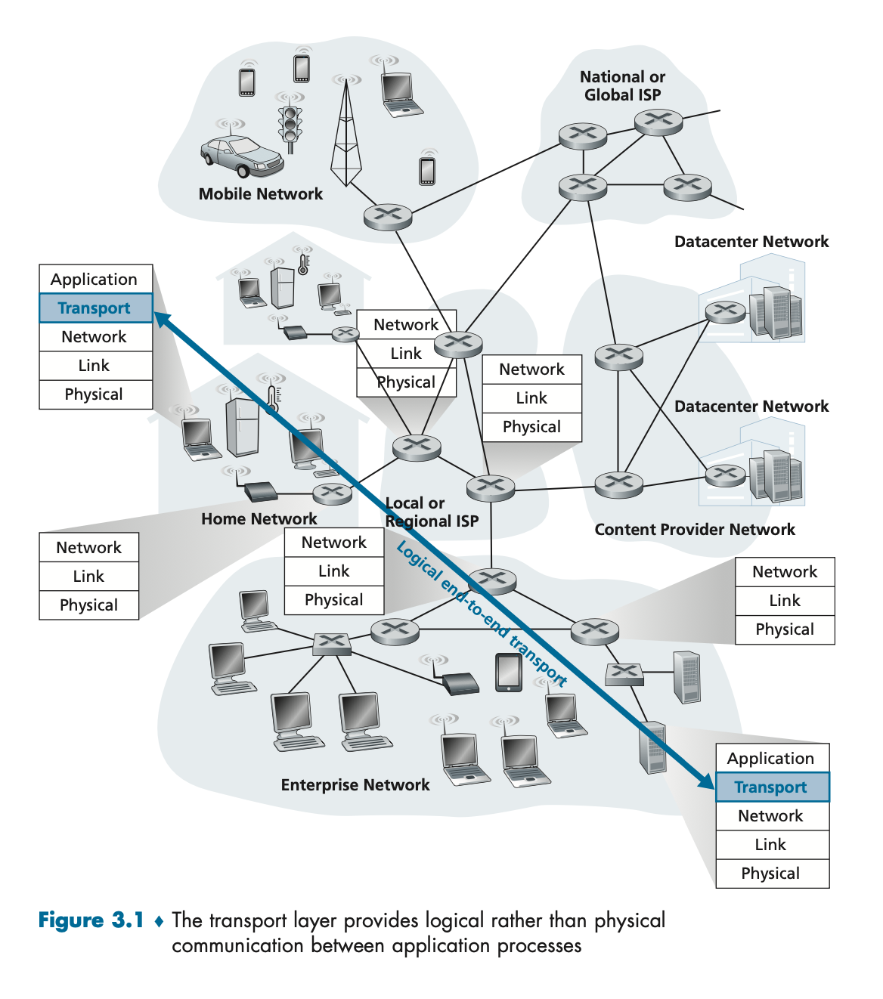
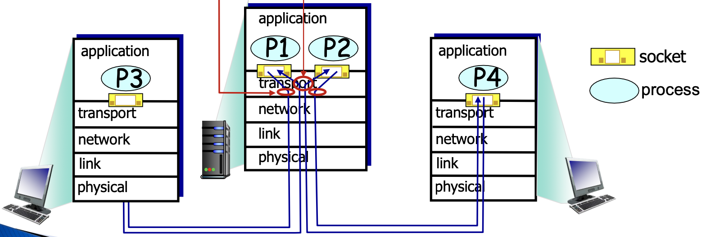
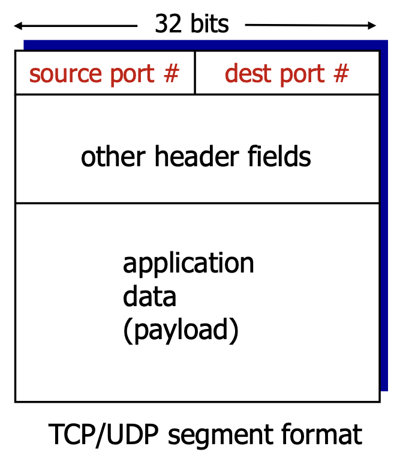
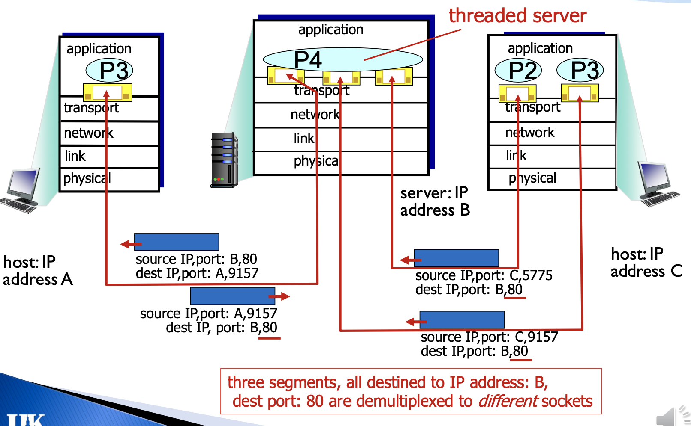

# The Transport Layer

Transport-layer protocols are implemented in the end systems but not in network routers. 

The transport layer converts the application-layer messages it receives from a sending application process into transport-layer packets, known as transport-layer **segments**.

This is done by breaking the application messages into smaller chunks and adding a transport-layer header to each chunk.

The transport layer then passes the segment to the network layer at the sending end system, where the segment is encapsulated within a network-layer packet (**datagram**) and sent to the destination.

**Network routers act only on the network-layer fields of the datagram and not examine the transport-layer segment**

On the receiver side, the network layer extracts the transport-layer segment from the datagram and passes the segment up to the transport layer.

**Within an end system, a transport protocol moves messages from application to the network layer and distribute messages from the network layer to the application processes.**
* Send Side: breaks app messages into **segments**, passes to network layer.
* Receiver Side: reassembles segments into messages, passes to app layer.

The network layer service model is a **best-effort delivery service**. The Internet Protocol makes no guarantee on the integrity of the segment's data, the orderly delivery of sefments, and delivering the segments.

Even when the underlying network protocol is unreliable (losses or duplicates packets), a transport protocol can offer reliable data transfer services.

## Transport Layer Service
* UDP (unreliable)
    * Transport-layer multiplexing and demultplexing
    * Error detection for integrity checking.
* TCP (reliable)
    * Transport-layer **multiplexing** and **demultplexing**
    * **Error detection** for integrity checking: checksum, which is used by the sender or receiver to detect bits flipped during transmission.
    * **Flow control**
    * **Congestion Control**: prevents any one TCP connection from swamping the links and routers with excessive amount of traffic.
    * **Sequence number**: allows for duplicate detection at receiver.
    * **Acknowledgments**: receiver explicitly tells sender that pkt received OK
    * **Timers**
    * Ensures data is delivered from sending process to receiving process, correctly and **in order**.
    * TCP converts IP's unreliable service between end systeem into a reliable data transport service between processes.

## Multiplexing/demultiplexing
* **Multiplexing at Sender**: handle data from multiple sockets, add transport header.
* **Demultiplexing at Receiver**: use header info to deliver received segments to correct socket.

Host uses **IP address & port numbers** to direct segment to appropriate socket.

**Connectionless Demultiplexing (UDP)**
* Created socket has host-**local port number**.
* Specify **destination IP address and port number**
* When host receives the UDP segment, it checks the destination port number and directs it to socket with that port number
* IP datagram with **same destination port numebr** but different source IP address or source port number will be directed to the **same socket**.

**Connection-oriented Demultiplexing**
* TCP socket identified by 4-tuple:
    1. Source IP address
    2. Source port number
    3. Destination IP address
    4. Destination port number
* Receiver uses all four values to direct segment to appropriate socket.
* Server host may support many simultaneous TCP sockets **identified by its own 4-tuple**.
* Web servers have **different sockets** for **each connecting client**.

## UDP
* Advantage:
    * Less overhead
    * Simple
    * Small header size
* Barebones Internet transport protocol
* Best effort service
* UDP segments may be:
    * lost
    * Delivered out-of-order to app
* Connectionless
* No handshaking between UDP sender, receiver.
* Each UDP segment handled independently of others.
* Application: 
    * Streaming multimedia apps (loss tolerant, rate sensitive)
    * DNS
    * SNMP
