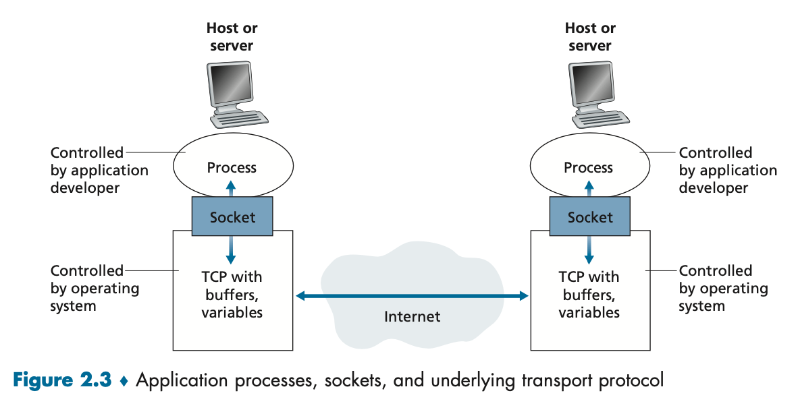
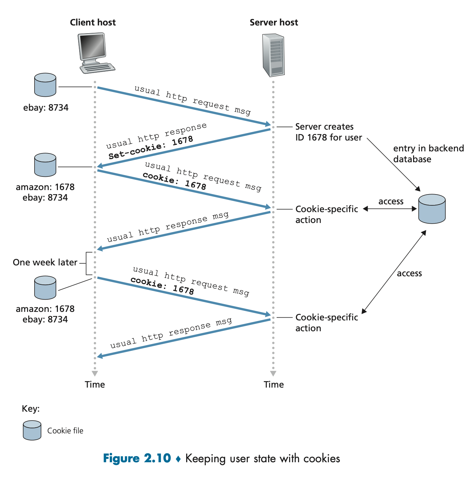

# Application Layer

* Application Layer is designed by the application developer and dictates how the application is structured over the various end systems.
    1. **Client Server Architecture**: there's an always-on host, called the **server**, which services requests from many other hosts, called **clients**. The server has a fixed, well-known IP address.
    2. **P2P Architecture:** there's minimal (or no) reliance on dedicated servers in data centers. The application exploits direct communication between pairs of intermittently connected hosts, called **peers**.

**Definition of Client and Server**

The process that initiates the communication is the **client**. The process that waits to be contacted to begin the session is the **server**.

## Interface between Process
Most applications consist of pairs of communicating processes, with the two processes in each pair sending messages to each other.

A process sends messages into and receives messages from the network through the software interface, **socket**, also known as the **Application Programming Interface (API)**.

## HTTP

The **HyperText Transfer Protocol (HTTP)** is the web's application-layer protocol. The client-side web browsers (such as Chrome) implement the client-side HTTP. The web server implements the server-side HTTP, with each web object addressable by a URL.

* HTTP defines how Web clients request Web pages from Web servers and how servers transfer Web pages to clients.
* When a user requests a web page, the browser sends HTTP request messages for the objects in the page to the server. The server receives the requests and responds with HTTP response messages that contain the objects.

### Non-Persistent and Persistent Connections
* **Non-Persistent Connections:** Each request-response pair is sent over a separate TCP connection.
* **Persistent Connections:** all request/response pairs be sent over the same TCP connection.

### Cookies

The HTTP server is stateless. However, it's desirable for a Website to identify users. Therefore, HTTP uses **cookies**, which allows sites to keep track of users.
* The browser keeps a cookie file that has the cookie number for websites we've visited.
* In an HTTP request, there's a header line to input the cookie number.

### Web Caching

A **Web cache**, also called a **proxy server**, is a network entity that satisfies HTTP requests on the behalf of an origin Web server.
* Note that a cache is both a server and a client at the same time.
* If there's a high-speed connection between the client and the cache, and if the cache has the requested object, web caches can substantially reduce traffic on the internet.

### HTTP/2

HTTP1 causes **Head of Line (HOL) blocking**, which happens when a web page sends a large video clip and many small objects. Using a single TCP connection, the video clip will take a long time to pass through the link, while the small objects are delayed as they wait behind the video clip.

HTTP/2 breaks each message into small frames, and after sending one frame from the video clip, the first frames of each of the small objects are sent.

## Electronic Mail

Major components:

1. **User agents**
2. **Mail servers**
3. **Simple Mail Transfer Protocol (SMTP):**

When the sender finishes the message, the user agent sends the message to the corresponding mail server, where the message is placed in the mail server's outgoing message queue.

When the receiver wants to read a message, the user agent retrieves the message from the mailbox in the corresponding server.

## DNS: Domain Name System

* Hostname to IP address translation
* Load distribution: having multiple IP addresses corresponding to one hostname.

**Implementation**
* Distributed database implemented in hierarchy of many name servers.
* Application-Layer Protocol host, routers, name servers to communicate to resolve address/name translation.
* Each ISP has one DNS name server.
 
**DNS Records**

Resource records (RR) format: (name, value, type, ttl)

* type=A
    * **name** is hostname
    * **value** is an IP address
* type=CNAME
    * **name** is an alias for the real name.
    * EX: www.ibm.com is actually sereast.backup2.ibm.com
    * **value** is the real name.
* type=NS
    * **name** is the domain
    * **value** is the hostname of the authoritative name server for this domain.
* type=MX
    * **value** is the name of the mail server associated with the **name**