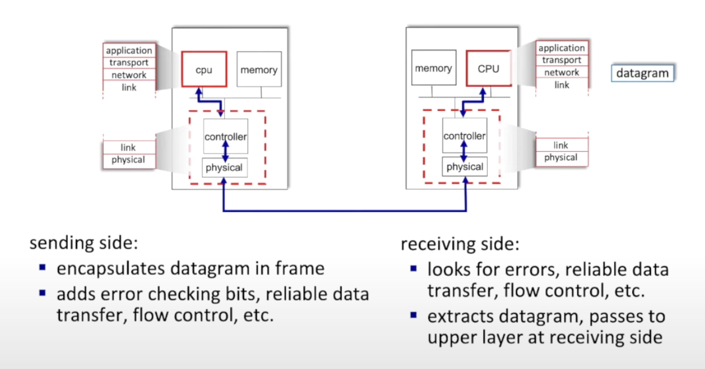

# Link-Layer

The link layer has the responsibility of transferring the datagram from one node to a physically adjacent node over a link.

The link layer and below is implemented in hardware, and above are implemented in software.

Link layer services include:
* **The link layer connects two nodes without any network layer router.**
* Error detection, and correction.
* Sharing a broadcast channel: multiple access.
* Encapsulate datagram into frame, adding header, trailer.
* MAC addresses in frame headers identify source, destination.
* Coordinating multiple nodes sharing the same communication channel.
* Flow Control: pacing between adjacent sending and receiving nodes.
* Error Detection: the receiver detects errors.
* Error Correction: receiver identifies and corrects bit errors without retransmission.

**Terminology:**
* Nodes: hosts, routers
* Links: Communication channels that directly connect physically adjacent nodes wired or wirelessly.

## Multiple Access Protocols

* Single shared broadcast channel.
* **Interference:** two or more simultaneous transmissions by nodes.
    * Collision: if a node receives two or more signals at the same time.
* **Multiple Access Protocol:** 
    * A distributed algorithm that determines how nodes share channels.
    * Communication about channel sharing uses the channel itself, but it doesn't have an out-of-band channel for coordination.

**An Ideal Multiple Access Protocol**

Given: Multiple access channel (MAC) of rate R bps.

**Desired Properties**
* When one node wants to transmit, it can send at rate R.
* When M nodes want to transmit, each can send at average rate R/M.
* Fully Decentralized
    * No special node to coordinate transmissions.
    * No synchronization of clocks, slots

**MAC Protocols: Taxonomy**
* **Channel Partitioning**
    * Divide the channel into smaller pieces.
* **Random Access**
    * Channel not divided, allow collisions.
* **Taking Turns**
    * Nodes take turns, but nodes with more to send can take longer turns.

## Channel Partitioning

**TDMA: Time Division Multiple Access**
* Access to channel in rounds.
* Each station gets a fixed length (length = packet transmission time) slot in each round.
* Unused slots go idle.

### FDMA

**FDMA: Frequency Division Multiple Access**
* Channel spectrum is divided into frequency bands.
Each station is assigned a fixed frequency band.
* Unused transmission time in frequency bands goes idle.

### CDMA

**CDMA: Code Division Multiple Access**
* Unique code assigned to each user.
    * All users use the entire spectrum, but each user has own code to encode data.
    * Allows multiple users to coexist and transmit simultaneously with minimal interference (if codes are orthogonal).
    * Encoding: inner product: (original data) X  (Assigned Code)
    * Decoding: summed inner-product: (encoded data) X (Assigned Code)

## Random Access Protocols

### ALOHA

### CSMA
* Listen before transmit
    * If channel sensed idle: transmit entire frame.
    * If channel sensed busy: defer transmission.
